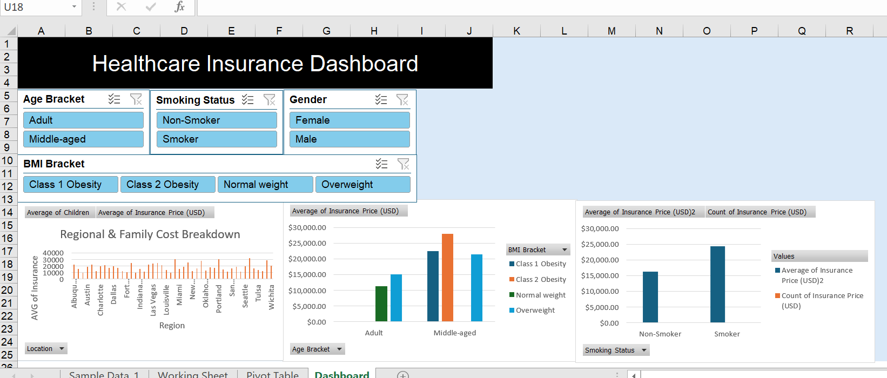
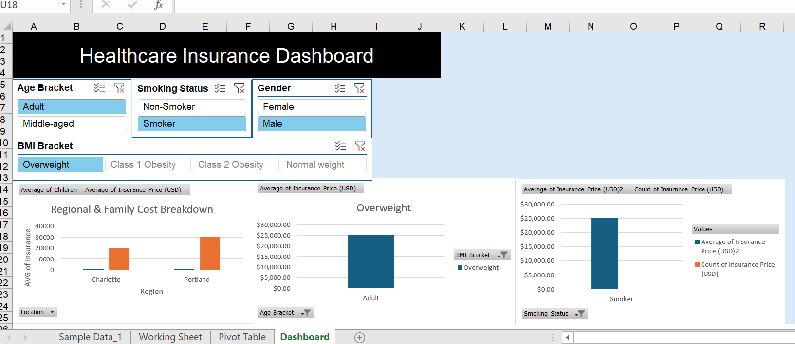
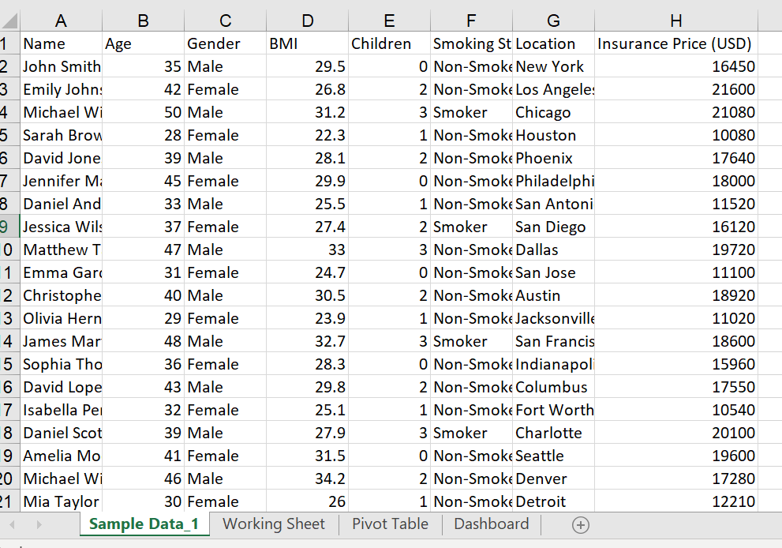
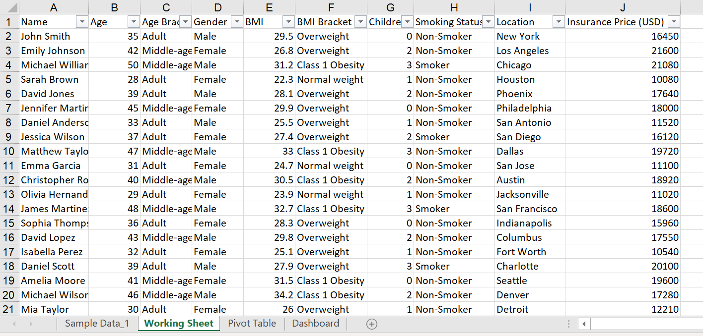

# Healthcare Insurance Portfolio & Risk Analysis Dashboard

An interactive, custom-built Microsoft Excel dashboard designed to analyze customer demographics, health metrics, and regional insurance pricing trends[cite: 3, 5]. This project transforms raw medical records into structured insights using advanced data transformation, pivot tables, and dynamic filtering[cite: 3, 4, 5].

## 📊 Dashboard Preview

## 🛠️ Tools & Techniques Used

- **Microsoft Excel**
- **Feature Engineering:** Segmented continuous data into standardized **Age Brackets** (Adult, Middle-age) and **BMI Risk Categories / Fat Status** (Normal weight, Overweight, Class 1 Obesity)[cite: 3].
- **Data Summarization:** Built master Pivot Tables utilizing **Average** and **Count** aggregations for key performance indicators[cite: 4].
- **Data Visualization & UX:** Designed a multi-chart layout featuring regional cost breakdowns and health-factor correlations[cite: 3, 5].
- **Interactivity:** Integrated synchronized **Slicers** (_Age Bracket_, _Smoking Status_, _Gender_, and _BMI Bracket_) connected via Report Connections to control all visual elements dynamically[cite: 3, 5].

## 📈 Key Insights & Objectives

- **Risk Factor Analysis:** Evaluated how lifestyle habits (such as smoking status and BMI categories) directly impact average healthcare insurance costs[cite: 3, 4, 5].
- **Demographic Breakdown:** Compared policy pricing distributions across major geographical locations[cite: 3, 5].
- **Executive Reporting:** Developed a clean, gridline-free UI layout optimized for quick data interpretation and filtering[cite: 3, 5].

## 🚀 How to View/Use

1. Download the [Healthcare Dashboard.xlsx](Healthcare Dashboard.xlsx) file from this repository.
2. Open the file in **Microsoft Excel** or Excel Online.
3. Use the interactive Slicers on the **Dashboard** tab to filter and explore data insights in real-time[cite: 3, 5].

---

_Created by Chathuranga Senanayaka_[cite: 1]
